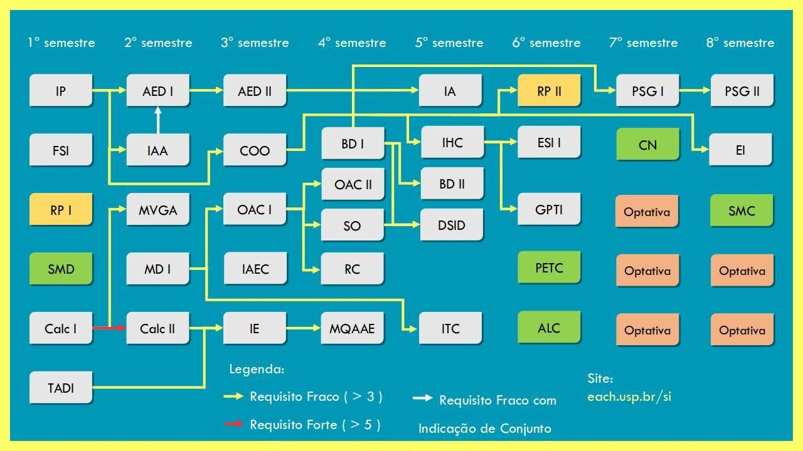

# Drive Sistemas de Informação
Drive de compartilhamento de estudos de Sistemas de Informação. Ao longo dos anos, os alunos criaram esse mega acervo de arquivos para ajudar uns aos outros nos estudos.
## Contribuindo
Envie um Pull Request com a sua contribuição, ou envie um email para driveeach@gmail.com

# Ciclo Básico
Os estudos compartilhados do Ciclo Básico podem ser encontrados [aqui](https://github.com/driveeach/drivecb)

# Utilidades

* [Repositórios de Apoio](https://github.com/driveeach/drivesi/blob/master/RepositoriosApoio.md) - Uma lista de repositórios no Github para apoio de todos nós programadores!
* [Sub-Reddits](https://github.com/driveeach/drivesi/blob/master/subreddits.md) - Uma lista de Subreddits relacionados a diversas coisas úteis!

# Grade Curricular

### Outros Drives
Você pode encontrar uma coletânea com todos os Drives da EACH [aqui](https://github.com/driveeach/driveeach)
